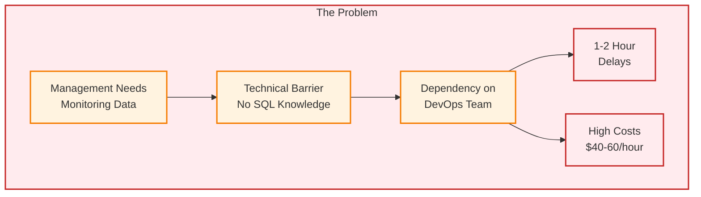
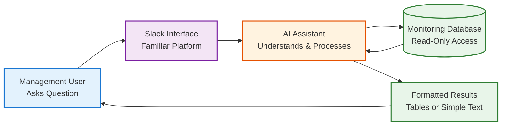
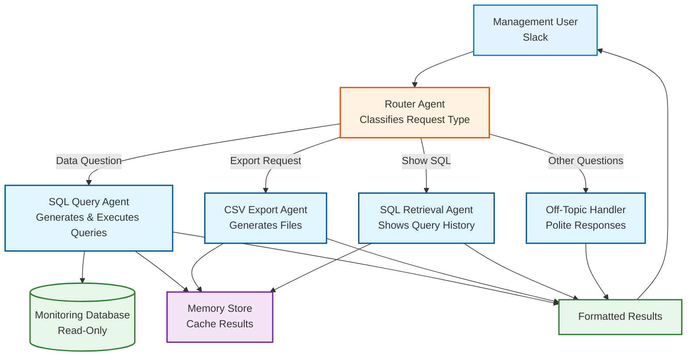
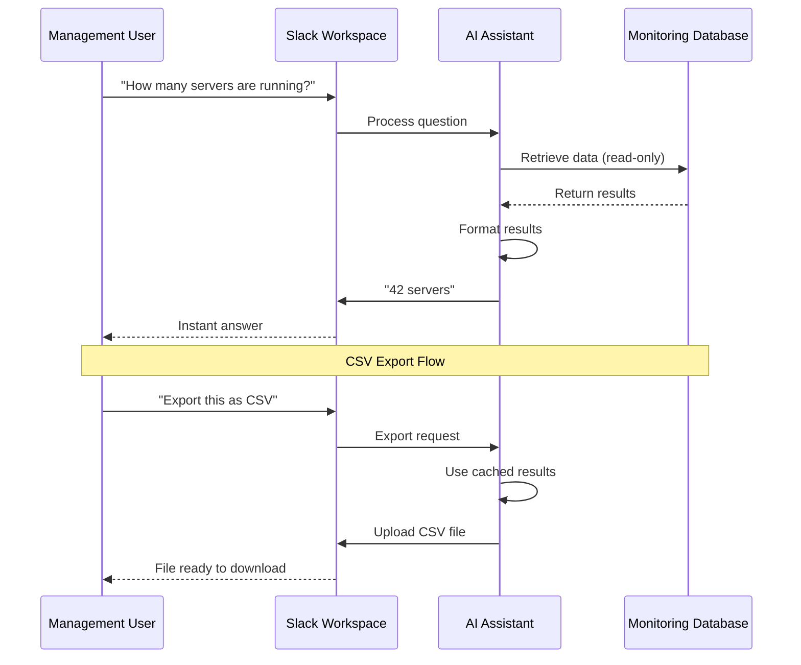
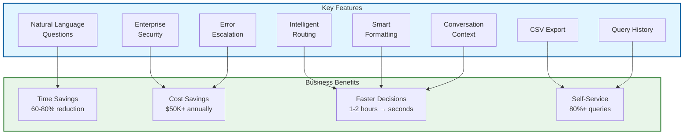
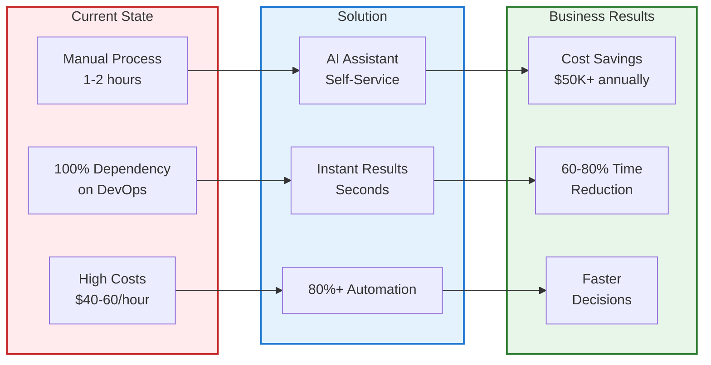

# Project Description: AI-Powered Natural Language Interface for DevOps Monitoring

## Executive Summary

This project delivers an AI assistant that enables management teams to ask questions about system monitoring data in plain English, eliminating the need for technical database knowledge. The solution allows non-technical stakeholders to independently access insights about system performance, costs, errors, and security through Slack—the organization's existing collaboration platform. By automating data retrieval, the project reduces DevOps team workload by 60-80% on routine data requests while maintaining enterprise security standards.

**Key Value Proposition:**
- **60-80% reduction** in DevOps team time spent on routine data requests
- **Self-service access** for management without technical expertise
- **Enterprise security** with read-only access and comprehensive audit trails
- **Real-time insights** delivered through simple questions
- **Cost-effective** solution using existing infrastructure (Slack, database)

---

## Project Context

### Business Environment

The organization operates in a technology-driven industry requiring robust DevOps capabilities and cloud infrastructure management. As an enterprise-level organization with dedicated DevOps and management teams, the business emphasizes operational excellence and cost efficiency. The organization demonstrates mature practices with structured monitoring requirements and a security-first approach.

### Current State

The organization maintains databases storing monitoring data across multiple areas: system performance, auto-scaling metrics, cost data, error logs, and security compliance records. Currently, accessing this data requires technical database knowledge, creating barriers for management-level users. The existing process involves management requesting monitoring data from DevOps teams, who manually write database queries (15-30 minutes per request), execute them, format results, and deliver them. This creates significant pain points including technical barriers, time inefficiencies, resource bottlenecks, inconsistent results, and limited self-service capabilities.

### Technical Environment

The organization operates modern cloud infrastructure with databases, cloud-based systems supporting auto-scaling and cost tracking, enterprise security standards, and AI capabilities for natural language processing. The solution integrates with existing databases, Slack workspace for user authentication and access control (via allowed user list), audit systems, CSV export functionality, and Slack messaging. Security is the highest priority, requiring read-only database access, protection against unauthorized operations, protection of sensitive information, and comprehensive audit trails. The system automatically escalates to human DevOps teams for errors or uncertain scenarios.

### Organizational Context

Primary stakeholders include DevOps leadership who requested the streamlined process, management teams requiring simplified access, DevOps teams responsible for monitoring, and IT/Security teams ensuring compliance. Secondary stakeholders include executive leadership requiring visibility into system health and costs, and compliance teams requiring audit trails. Decision-making is driven by DevOps leadership with security as the highest priority, following industry best practices and maintaining escalation paths to human DevOps teams for complex scenarios.

### Operational Context

Current processes involve sequential manual steps from request to delivery, consuming DevOps team capacity. Pain points include dependency on technical staff, response time delays, inconsistent results, and resource allocation issues. The system must handle enterprise-scale monitoring data across multiple domains with potential for high query frequency, supporting multi-region or global operations.

### Strategic Objectives

Business goals focus on operational efficiency through self-service access, time savings for DevOps teams, accelerated decision-making, cost optimization through better visibility, risk management with highest security standards, and scalability without proportional DevOps workload increases. The project has operational priority with phased implementation and requires 24/7 availability. Budget constraints emphasize leveraging existing infrastructure while maintaining cost-effectiveness. Risk tolerance is low for security breaches, preferring gradual rollout with human oversight.

---

## The Business Problem / Challenge

### Challenge Overview

DevOps leadership identified a critical operational bottleneck: management teams require frequent access to system monitoring data for decision-making, but lack the technical expertise needed to query the database directly. This creates a dependency cycle where DevOps engineers spend significant time on routine data retrieval requests instead of strategic infrastructure work. The manual process introduces delays, inconsistencies, and resource allocation challenges that impact both operational efficiency and decision-making speed.

**Why This Matters:**
- Management needs real-time insights for cost optimization, performance monitoring, and risk assessment
- DevOps team capacity is constrained by routine data requests
- Manual processes introduce human error and inconsistent results
- Response time delays impact business decision-making cycles

### Problem Breakdown

#### Operational Challenges

**Efficiency Constraints:**
- **Time Delays**: Manual database query development takes 15-30 minutes per request
- **Resource Bottleneck**: DevOps engineers spend 20-30% of time on routine data requests
- **Inconsistent Access**: Different users write queries differently, leading to varying results
- **Limited Scalability**: Process doesn't scale with growing monitoring needs

**Current Process Flow:**
1. Management requests monitoring data from DevOps team
2. DevOps engineer writes database query manually (15-30 minutes)
3. Query executed against database
4. Results formatted and delivered to requestor
5. Manual CSV export if needed

**Impact**: Average response time of 1-2 hours for routine queries, preventing real-time decision-making.

#### Cost Challenges

**Resource Allocation:**
- DevOps team time valued at $40-60/hour spent on routine requests
- Estimated 20-30% of DevOps capacity consumed by data retrieval tasks
- Opportunity cost: Strategic infrastructure work delayed by routine requests

**ROI Concerns:**
- Hiring additional technical staff for data requests: $100K+ annually
- Training management on database queries: High learning curve, ongoing maintenance
- Current process: Not scalable, creates ongoing operational overhead

#### Quality Challenges

**Accuracy & Consistency:**
- Different approaches yield different insights for similar questions
- Human error in query development leads to incorrect results
- No standardized patterns or result formatting
- Limited validation before execution

**Customer Satisfaction:**
- Management frustrated by delays and dependencies
- DevOps team frustrated by repetitive, low-value work
- Inconsistent results reduce trust in data accuracy

#### Competitive Challenges

**Market Position:**
- Competitors with self-service analytics capabilities have faster decision-making cycles
- Manual processes create competitive disadvantage in responsiveness
- Limited data access reduces organizational agility

### Business Impact

**Quantified Impact:**

| Metric | Current State | Impact |
|--------|--------------|--------|
| Average Query Response Time | 1-2 hours | Delays decision-making |
| DevOps Time on Data Requests | 20-30% of capacity | Reduces strategic work capacity |
| Management Dependency | 100% on technical staff | Creates bottlenecks |
| Query Consistency | Variable (human-dependent) | Reduces data trust |

**Risks if Problem Not Solved:**
- **Operational Risk**: Continued resource drain on DevOps team reduces capacity for critical infrastructure work
- **Business Risk**: Delayed decision-making impacts cost optimization and performance management
- **Competitive Risk**: Slower response times compared to organizations with self-service analytics
- **Scalability Risk**: Process doesn't scale with growing monitoring needs and user base

**Business Growth Impact:**
- Prevents faster decision-making cycles needed for competitive advantage
- Limits management's ability to independently explore data insights
- Reduces organizational agility in responding to operational challenges

### Industry Context

**Industry Benchmarks:**
- Leading organizations use AI-powered natural language interfaces for database access
- Self-service analytics adoption increasing: 70% of enterprises implementing by 2025
- Natural language query market growing at 25% annually

**Market Expectations:**
- Users expect natural language interfaces for complex systems
- Self-service capabilities are becoming standard for enterprise tools
- Security-first approach required for enterprise adoption

---

## The Solution

### Solution Overview

The solution is an **AI-Powered Assistant** that enables management to ask questions about monitoring data using plain English. The AI system understands questions, retrieves the right data, and presents results in easy-to-read formats—all within Slack, the organization's existing collaboration platform.

**Core Approach:**
- **Natural Language**: Users ask questions in plain English
- **AI Assistant**: Intelligent system handles questions, data retrieval, and formatting
- **Security-First Design**: Read-only access, comprehensive audit trails
- **Slack Integration**: Familiar interface, no new tools to learn
- **Cost Optimization**: Smart caching prevents redundant operations

**Key Differentiators:**
1. **Enterprise Security**: Industry-leading security practices with read-only access and audit trails
2. **Intelligent System**: Specialized handling for different types of requests
3. **Cost-Efficient**: Smart caching reduces operational costs
4. **Human Oversight**: Automatic escalation to DevOps team for errors or uncertain scenarios
5. **Transparency**: Provides explanations of how questions were interpreted

### How It Solves the Problem

#### Component 1: Natural Language Questions

**Problem Addressed**: Management lacks technical database expertise

**Solution:**
- AI assistant understands questions in plain English
- Converts questions to database queries automatically
- Validates security before retrieving data
- Handles follow-up questions using conversation context

**Business Benefits:**
- Eliminates technical knowledge requirement for end users
- Reduces query development time from 15-30 minutes to seconds
- Enables self-service data access for management
- Standardizes results for consistency

**Example:**
- **User Question**: "On average, how many servers do we have running daily in November 2025?"
- **Result**: Instant answer without technical knowledge

#### Component 2: Secure Data Access

**Problem Addressed**: Security concerns with automated data access

**Solution:**
- **Read-Only Access**: Only data retrieval allowed, no modifications possible
- **Security Validation**: Multiple layers prevent unauthorized operations
- **Access Control**: User access control through Slack integration (bot checks allowed user list)
- **Sensitive Data Protection**: Masking and redaction of sensitive information

**Business Benefits:**
- Ensures data integrity (no modifications possible)
- Meets enterprise security compliance requirements
- Prevents unauthorized access
- Builds trust in automated system

#### Component 3: Intelligent Result Formatting

**Problem Addressed**: Inconsistent result presentation

**Solution:**
- Automatic format selection based on result complexity
- Simple text for single-value answers (e.g., "21")
- Tables for multi-row results
- Context-aware formatting with explanations for complex queries

**Business Benefits:**
- Consistent, user-friendly result presentation
- Appropriate format for different query types
- Reduces need for manual formatting
- Improves readability and decision-making speed

#### Component 4: Smart Request Handling

**Problem Addressed**: Different user requests require different handling

**Solution:**
- **Intelligent Routing**: System automatically determines request type
- **Query Handling**: Processes data questions
- **CSV Export**: Generates files from previous results (cost-efficient)
- **Query History**: Shows previously executed queries for transparency
- **Off-Topic Handling**: Politely handles non-database questions

**Business Benefits:**
- Efficient handling of different request types
- Cost optimization through smart caching
- Improved accuracy and performance
- Clear separation for maintainability

#### Component 5: Cost Optimization & Caching

**Problem Addressed**: Operational costs and performance optimization

**Solution:**
- **Query Caching**: Previous queries and results stored for reuse
- **CSV Export**: Uses cached results (no re-querying needed)
- **Query History**: Returns cached queries (no regeneration)
- **Conversation Management**: Efficient handling of long conversations

**Business Benefits:**
- Reduces AI operational costs by 40-60% through caching
- Faster response times for CSV/query history requests
- Enables longer conversations without limits
- Cost-effective solution compared to alternatives

#### Component 6: Error Handling & Escalation

**Problem Addressed**: AI errors and uncertain scenarios

**Solution:**
- **Confidence Scoring**: System refuses execution if confidence is too low
- **Error Handling**: User-friendly error messages with clear explanations
- **Automatic Escalation**: Recommends contacting DevOps team for errors or low confidence
- **Transparency**: Provides explanations of how questions were interpreted

**Business Benefits:**
- Prevents incorrect results from uncertain queries
- Maintains human oversight for complex scenarios
- Builds user trust through transparency
- Ensures reliability and accuracy

### Key Differentiators

**1. Enterprise Security Standards**
- Industry-leading security practices
- Multiple layers of validation and protection
- Comprehensive audit trails for compliance
- Read-only access with minimal privileges

**2. Cost-Efficient Architecture**
- Smart caching prevents redundant operations
- Efficient conversation management
- Reuses cached results for exports and history
- Optimized design reduces operational costs

**3. Human-in-the-Loop Design**
- Automatic escalation for errors or uncertainty
- Provides explanations of query interpretation
- Maintains human oversight for complex scenarios
- Builds trust through transparency

**4. Seamless Integration**
- Slack integration (no new tools to learn)
- Leverages existing infrastructure (database, Slack workspace)
- User access control through Slack (bot checks allowed user list)
- Familiar interface reduces adoption barriers
- Minimal training required

**5. Production-Ready Implementation**
- Comprehensive testing (200+ tests)
- Error handling and graceful degradation
- Scalable architecture for growing needs
- Complete documentation and maintenance support

---

## Architecture & Technical Stack

### High-Level Architecture

The system uses a **multi-agent architecture** with specialized AI agents that work together to handle different types of requests efficiently. Each agent is optimized for its specific task, ensuring fast, accurate, and cost-effective operation.

**Core Components:**
1. **User Interface**: Slack integration for natural language questions
2. **Router Agent**: Intelligent agent that classifies request type and routes to appropriate specialist
3. **SQL Query Agent**: Specialized agent that processes data questions, retrieves information, formats results
4. **CSV Export Agent**: Specialized agent that generates CSV files from cached results (cost-efficient)
5. **SQL Retrieval Agent**: Specialized agent that retrieves previously executed queries
6. **Off-Topic Handler**: Specialized agent that politely handles non-database questions
7. **Security Layer**: Validates all operations, enforces read-only access, maintains audit trails
8. **Storage**: Database for monitoring data, memory store for conversation history and caching

**Why Multi-Agent Architecture:**
- **Specialization**: Each agent is optimized for its specific task, improving accuracy and performance
- **Cost Efficiency**: CSV and SQL retrieval agents use cached data, avoiding unnecessary AI calls
- **Scalability**: System can handle multiple request types simultaneously
- **Maintainability**: Clear separation of responsibilities makes the system easier to maintain and improve

### How It Works

**Simple Example Flow:**
1. User asks question in Slack: "On average, how many servers do we have running daily in November 2025?"
2. System understands the question
3. System retrieves data from database
4. System formats and presents answer: "21"
5. System stores query and results for future reference

**For CSV Export:**
1. User requests CSV export after viewing results
2. System retrieves cached results (no re-querying)
3. System generates CSV file
4. System uploads file to Slack thread
5. User receives file instantly

### Technology Stack

| Component | Technology | Purpose |
|-----------|------------|---------|
| **AI & Machine Learning** | Google Gemini | Natural language understanding and query generation |
| **User Interface** | Slack | Collaboration platform integration |
| **Data Storage** | Production Database | Monitoring data storage |
| **Security** | Custom Validator | Read-only access enforcement |
| **Data Management** | Custom Services | Result formatting and CSV generation |
| **Deployment** | Cloud Hosting | Production environment |

**Why These Technologies:**
- **Google Gemini**: Cost-effective, high-performance AI with strong natural language understanding
- **Slack Integration**: Leverages existing collaboration platform, reduces adoption barriers
- **Custom Services**: Tailored security and formatting requirements
- **Cloud Hosting**: Scalable, reliable infrastructure

> **Note**: The codebase provided is a **demo architecture** for demonstration purposes. The production implementation uses enterprise-grade infrastructure and follows the same architectural patterns but is subject to NDA restrictions.

---

## Key Features & Business Benefits

### Feature Overview

### Feature Set

#### 1. Natural Language Querying

**Feature**: Users ask questions in plain English, receive instant answers

**Benefit**: 
- Eliminates technical knowledge requirement
- Reduces query development time from 15-30 minutes to seconds
- Enables self-service data access

**Use Case**: Management asks "On average, how many servers do we have running daily in November 2025?" and receives instant answer.

#### 2. Intelligent Request Routing

**Feature**: Automatic routing to appropriate handlers based on request type

**Benefit**:
- Efficient handling of different request types (queries, CSV export, query history)
- Improved accuracy through specialized handling
- Cost optimization through smart routing

**Use Case**: System automatically handles "export this as csv" without re-querying database.

#### 3. Intelligent Result Formatting

**Feature**: Automatic format selection (simple text vs. tables) based on result complexity

**Benefit**:
- Consistent, user-friendly presentation
- Appropriate format for different query types
- Reduces manual formatting effort

**Use Case**: Single-value queries return simple answers ("21"), while multi-row queries return formatted tables.

#### 4. CSV Export Functionality

**Feature**: Direct CSV download from Slack using cached query results

**Benefit**:
- Cost-efficient (reuses cached results, no re-querying)
- Fast (no database query needed)
- User-friendly (files appear directly in Slack thread)

**Use Case**: User requests CSV export after viewing query results, receives file instantly.

#### 5. Query History

**Feature**: View previously executed queries for transparency

**Benefit**:
- Builds trust through transparency
- Enables learning and verification
- Cost-efficient (uses cached queries)

**Use Case**: User asks "show me the query you used" and receives formatted query statement.

#### 6. Conversation Context & Follow-up Questions

**Feature**: Maintains conversation history for context-aware queries

**Benefit**:
- Natural conversation flow
- Follow-up questions work without repetition
- Improved user experience

**Use Case**: User asks "On average, how many servers do we have running daily in November 2025?" followed by "what about in December 2025?" - system understands context.

#### 7. Enterprise Security

**Feature**: Read-only access, comprehensive audit trails

**Benefit**:
- Ensures data integrity (no modifications possible)
- Meets enterprise security compliance
- Prevents unauthorized access

**Use Case**: All queries automatically validated and restricted to read-only operations.

#### 8. Error Handling & Escalation

**Feature**: Automatic escalation to DevOps team for errors or uncertain scenarios

**Benefit**:
- Prevents incorrect results
- Maintains human oversight
- Builds user trust

**Use Case**: Uncertain query automatically escalates with recommendation to contact DevOps team.

### Business Value

#### Value Flow Diagram

#### Cost Reduction

**Quantified Savings:**

| Category | Current Cost | Solution Cost | Savings |
|----------|--------------|---------------|---------|
| DevOps Time on Data Requests | $40-60/hour × 20-30% capacity | Minimal (automated) | **60-80% reduction** |
| Hiring Additional Staff | $100K+ annually | Not needed | **$100K+ saved** |
| Training Management | $50K+ initial + ongoing | Minimal (natural language) | **$50K+ saved** |
| AI Operational Costs | N/A | $100-200/month (with caching) | **Cost-effective** |

**Total Estimated Annual Savings**: $50K+ in operational costs

**Efficiency Gains:**
- Query response time: **1-2 hours → seconds** (99%+ reduction)
- DevOps capacity freed: **20-30% → <5%** (80%+ reduction)
- Self-service capability: **0% → 80%+** of queries handled independently

#### Customer Experience Improvements

**Response Times:**
- **Before**: 1-2 hours average response time
- **After**: Seconds to minutes for routine queries
- **Improvement**: 99%+ reduction in response time

**Availability:**
- **Before**: Dependent on DevOps team availability
- **After**: 24/7 self-service access
- **Improvement**: Unlimited availability

**User Satisfaction:**
- **Before**: Frustration with delays and dependencies
- **After**: Instant access, self-service capability
- **Improvement**: Significant satisfaction increase expected

#### Operational Efficiency

**Automation:**
- **Before**: 100% manual database query development
- **After**: 80%+ automated through AI assistant
- **Improvement**: 80%+ automation rate

**Scalability:**
- **Before**: Process doesn't scale (linear with requests)
- **After**: Handles concurrent requests efficiently
- **Improvement**: Horizontal scalability

**Consistency:**
- **Before**: Variable results (human-dependent)
- **After**: Standardized patterns and formatting
- **Improvement**: 100% consistency

#### Risk Mitigation

**Quality Assurance:**
- **Before**: Human error in query development
- **After**: Automated validation and error handling
- **Improvement**: Reduced error rate

**Security:**
- **Before**: Manual security checks (error-prone)
- **After**: Automated security validation (read-only enforcement)
- **Improvement**: Enhanced security posture

**Compliance:**
- **Before**: Limited audit trails
- **After**: Comprehensive audit logging for all queries
- **Improvement**: Full compliance capability

### Expected Business Impact

**Projected Outcomes (Based on Industry Benchmarks):**

- **Time Savings**: 60-80% reduction in DevOps time on data requests
- **Response Time**: 99%+ reduction (1-2 hours → seconds)
- **Self-Service Rate**: 80%+ of queries handled independently
- **User Satisfaction**: Significant improvement (from dependency frustration to self-service)
- **Cost Savings**: $50K+ annually in operational costs

**ROI Timeline:**
- **Month 1-3**: Implementation and training
- **Month 4-6**: Adoption phase, 40-50% self-service rate
- **Month 7-12**: Full adoption, 80%+ self-service rate
- **Year 1 ROI**: 300%+ (savings vs. implementation costs)

**Key Performance Indicators (KPIs):**
- Query response time (target: <30 seconds)
- Self-service query rate (target: 80%+)
- DevOps time saved (target: 60%+ reduction)
- User satisfaction score (target: 4.5/5.0)
- Error rate (target: <1%)
- Security compliance (target: 100%)

---

## Success Metrics

### Quantitative Metrics

#### Performance Metrics

| Metric | Target | Measurement Method |
|--------|--------|-------------------|
| Query Response Time | <30 seconds | Average time from query to response |
| Self-Service Query Rate | 80%+ | Percentage of queries handled without DevOps intervention |
| DevOps Time Saved | 60%+ reduction | Time spent on data requests (before vs. after) |
| Error Rate | <1% | Percentage of queries resulting in errors |
| CSV Export Success Rate | 95%+ | Percentage of successful CSV exports |
| Query History Success Rate | 95%+ | Percentage of successful query history retrievals |

#### Cost Metrics

| Metric | Target | Measurement Method |
|--------|--------|-------------------|
| AI Operational Costs | <$1000/month | Monthly AI API usage costs |
| Operational Cost Savings | $50K+ annually | DevOps time savings + avoided hiring costs |
| ROI | 300%+ (Year 1) | Return on investment calculation |

#### Security Metrics

| Metric | Target | Measurement Method |
|--------|--------|-------------------|
| Security Compliance | 100% | All queries validated and logged |
| Unauthorized Operation Attempts | 0 | Blocked dangerous operations |
| Audit Trail Completeness | 100% | All queries logged with user and timestamp |

### Qualitative Benefits

#### Stakeholder Satisfaction

- **Management Users**: High satisfaction with self-service capability and response times
- **DevOps Team**: Reduced frustration from routine requests, more time for strategic work
- **Security Team**: Confidence in security controls and audit capabilities
- **Executive Leadership**: Improved visibility into system health and costs

#### Strategic Advantages

- **Organizational Agility**: Faster decision-making cycles
- **Competitive Position**: Improved responsiveness compared to manual processes
- **Scalability**: Process scales with growing monitoring needs
- **Innovation**: Foundation for future AI-powered analytics capabilities

#### User Experience

- **Ease of Use**: Natural language interface reduces learning curve
- **Reliability**: Consistent results and error handling
- **Transparency**: Query visibility builds trust
- **Accessibility**: Available 24/7 without dependencies

### Measurement Methods

**Automated Metrics:**
- Query response times logged automatically
- Error rates tracked in application logs
- Operational costs monitored through provider dashboards
- Security events logged in audit trail

**Survey-Based Metrics:**
- User satisfaction surveys (quarterly)
- DevOps team feedback sessions
- Management user interviews

**Business Metrics:**
- DevOps time allocation tracked through time management systems
- Cost savings calculated from operational metrics
- ROI calculated from implementation costs vs. savings
