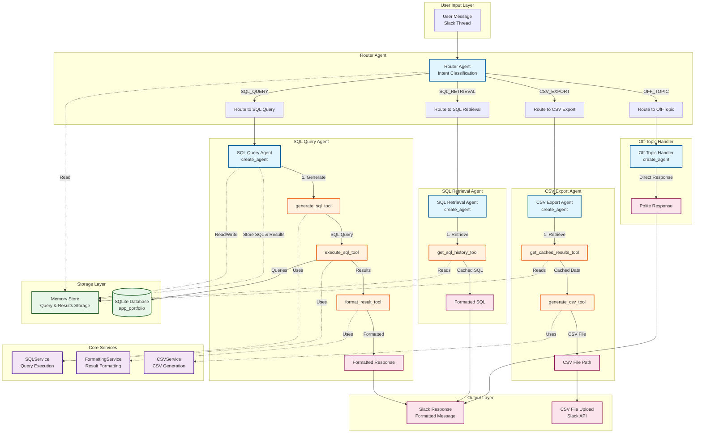

# Stage 2: Multi-Agent Architecture

## Overview

This document describes the complete architecture for the SQL database analytics chatbot in Slack. The system uses a modern LangChain ReAct-based multi-agent architecture with a router pattern, specialized agents, and cost-optimization strategies.

**Architecture Pattern**: Router with Unified SQL Query Agent  
**Reference**: Based on LangGraph routing patterns and [dual-rag architecture](https://github.com/Kochurovskyi/dual-rag/blob/main/documentation/graph_design.md)

**Design Principles**:
- **Simplicity**: Unified SQL Query Agent handles all SQL operations (generation, execution, formatting)
- **Cost Efficiency**: Smart caching prevents token waste on CSV/SQL retrieval requests
- **Maintainability**: Clear separation of concerns with specialized agents for different intents
- **Modern Approach**: Uses `create_agent` from LangChain (modern ReAct agent pattern)

## Assignment Requirements Alignment

This design implements all requirements from the AI Engineer Test Task:
- ✅ SQL database integration with app portfolio schema
- ✅ Natural language to SQL conversion
- ✅ Query execution and result formatting (simple text vs. tables)
- ✅ Follow-up question support (conversation context maintained)
- ✅ CSV export functionality (uses cached results for cost efficiency)
- ✅ SQL statement retrieval (uses cached queries for cost efficiency)
- ✅ Off-topic question handling
- ✅ Cost-effective token usage (smart caching prevents regeneration)

## Architecture Design

### High-Level Architecture

```
User Message (Slack)
    ↓
Agent Orchestrator (Coordinator/Service - NOT an agent)
    ↓
Router Agent (Intent Classification)
    ↓
    ├─→ SQL Query Agent (Unified: generation + execution + formatting)
    ├─→ CSV Export Agent (uses cached results)
    ├─→ SQL Retrieval Agent (uses cached SQL)
    └─→ Off-Topic Handler
    ↓
Stream Response to Slack
```

**Note**: The **Agent Orchestrator** is a coordinator/service class that:
- Receives messages from Slack handlers
- Coordinates router and specialized agents
- Handles streaming responses back to Slack
- Manages memory store integration (SQL queries and results stored in memory_store)

**Architecture Pattern**: Router with Unified SQL Query Agent
- **Agent Orchestrator**: Coordinator/service (not an agent) that coordinates agent execution and Slack integration
- **Router Agent**: Classifies intent and routes to specialized agents
- **SQL Query Agent**: Unified agent handling SQL generation, execution, and formatting
- **CSV Export Agent**: Generates CSV from cached results (cost-efficient)
- **SQL Retrieval Agent**: Retrieves cached SQL statements (cost-efficient)
- **Off-Topic Handler**: Handles non-SQL questions

### Multi-Agent System Diagram



### Agent Interaction Flow

```mermaid
sequenceDiagram
    participant User
    participant Router as Router Agent
    participant SQL as SQL Query Agent
    participant CSV as CSV Export Agent
    participant Ret as SQL Retrieval Agent
    participant Off as Off-Topic Handler
    participant Tools as LangChain Tools
    participant DB as Database
    participant Memory as Memory Store
    participant Memory as Memory Store
    
    User->>Router: "How many apps are there?"
    Router->>Memory: Get conversation history
    Memory-->>Router: Conversation context
    Router->>Router: Classify intent: SQL_QUERY
    Router->>SQL: Route to SQL Query Agent
    
    SQL->>Memory: Get conversation history
    Memory-->>SQL: Previous messages
    SQL->>Tools: generate_sql_tool(question, history)
    Tools-->>SQL: SQL query
    SQL->>Tools: execute_sql_tool(sql_query)
    Tools->>DB: Execute query
    DB-->>Tools: Query results
    Tools-->>SQL: Results data
    SQL->>Tools: format_result_tool(results, question)
    Tools-->>SQL: Formatted response
    SQL->>Memory: Store query & results
    SQL->>Memory: Save response
    SQL-->>User: "There are 50 apps in the portfolio."
    
    User->>Router: "Export this as CSV"
    Router->>Router: Classify intent: CSV_EXPORT
    Router->>CSV: Route to CSV Export Agent
    
    CSV->>Memory: get_cached_results_tool(thread_ts)
    Memory-->>CSV: Cached query results
    CSV->>Tools: generate_csv_tool(data)
    Tools-->>CSV: CSV file path
    CSV-->>User: CSV file uploaded to Slack
    
    User->>Router: "Show me the SQL"
    Router->>Router: Classify intent: SQL_RETRIEVAL
    Router->>Ret: Route to SQL Retrieval Agent
    
    Ret->>Memory: get_sql_history_tool(thread_ts)
    Memory-->>Ret: Cached SQL query
    Ret-->>User: "```sql\nSELECT COUNT(*) FROM app_portfolio\n```"
    
    User->>Router: "Hello, how are you?"
    Router->>Router: Classify intent: OFF_TOPIC
    Router->>Off: Route to Off-Topic Handler
    
    Off->>Off: Generate polite response
    Off-->>User: "Hello! I'm a database analytics assistant..."
```

## Architecture Validation

### Validation Against LangChain Best Practices

**Validation Source**: LangChain/LangGraph official documentation

#### ✅ Valid Patterns

1. **Router Pattern**: The router agent pattern is a well-established LangChain pattern for multi-agent systems
   - **Validation**: Confirmed as one of 5 main multi-agent patterns (Router, Subagents, Handoffs, Skills, Custom workflow)
   - **Performance**: 3 model calls for one-shot requests, 5 calls for multi-domain tasks
   - **Benefits**: Parallel execution, specialized agents, efficient resource use
   - **Best For**: Multi-domain tasks requiring parallel execution
   - Reference: [LangChain Multi-Agent Patterns](https://docs.langchain.com/oss/python/langchain/multi-agent/index)

2. **ReAct Agent Usage**: Using `create_agent` is the modern LangChain approach
   - **Validation**: Confirmed as standard pattern for tool-calling agents
   - **Benefits**: Combines reasoning and action, dynamic decision-making
   - **Note**: Can be used within LangGraph workflows as nodes
   - **Implementation**: All specialized agents (SQL Query, CSV Export, SQL Retrieval) use `create_agent`
   - Reference: [LangChain ReAct Agent](https://python.langchain.com/v0.1/docs/modules/agents/agent_types/react/)

3. **Tool-Based Architecture**: Defining tools for each agent is correct
   - **Validation**: Tools are the standard way to extend agent capabilities
   - **Benefits**: Clear boundaries, reusability, enables agent-to-agent communication
   - **Pattern**: Agents use tools to perform actions, tools can be shared across agents
   - Reference: [LangGraph Tools Documentation](https://langchain-ai.github.io/langgraph/agents/tools/)

4. **LangGraph Integration**: The plan can leverage LangGraph for orchestration
   - **Validation**: LangGraph supports routing workflows with conditional edges
   - **Benefits**: Explicit state management, visualization, built-in error handling
   - **Pattern**: Router node → conditional edges → specialized agent nodes
   - Reference: [LangGraph Routing Workflows](https://langchain-ai.github.io/langgraph/tutorials/workflows/)

### Architecture Design Decisions

#### 1. Unified SQL Query Agent

**Design Choice**: Single agent handles SQL generation, execution, and formatting

**Rationale**:
- These steps are tightly coupled and sequential
- Single agent handles the full SQL workflow efficiently
- Reduces agent-to-agent communication overhead
- Simpler state management
- Lower token costs (fewer agent invocations)

**Implementation**:
- Uses `create_agent` with multiple tools:
  - `generate_sql_tool`: Converts natural language to SQL (schema in system prompt)
  - `execute_sql_tool`: Executes SQL query
  - `format_result_tool`: Formats results (simple text vs. table)

**Note**: Database schema is included in the system prompt (static), eliminating the need for `get_schema_tool`. This reduces token usage and simplifies the agent flow.

#### 2. Router Agent Implementation

**Design Choice**: Router agent uses rule-based classification (efficient for current use case)

**Current Implementation** (Phase 3):
- Uses simple rule-based keyword matching (`_classify_intent_simple`)
- Classifies intent: SQL_QUERY, CSV_EXPORT, SQL_RETRIEVAL, OFF_TOPIC
- Handles follow-up questions by checking conversation context
- Fast and efficient for production use

**Future Enhancement** (Phase 4):
- Will use `create_agent` from `langchain.agents` with routing tools
- ReAct pattern for handling ambiguous intents
- Better reasoning for complex routing scenarios

**Benefits**:
- Current rule-based approach: Fast, deterministic, low latency
- Future ReAct approach: Better handling of ambiguous intents and complex scenarios

#### 3. Cost Optimization Strategy

**Design Choice**: Smart caching prevents token waste

**Current Implementation**:
- SQL queries and results stored in `memory_store` after execution
- CSV export uses cached results from `memory_store` (no SQL regeneration)
- SQL retrieval returns cached SQL from `memory_store` (no regeneration)
- Conversation history maintained for follow-up questions
- Conversation history compression implemented (triggers at 80% of token limit)
- Thread-scoped storage for SQL queries and results

**Benefits**:
- Meets assignment requirement for cost-effective token usage
- Prevents unnecessary LLM calls
- Faster response times for CSV/SQL retrieval requests
- Significant token savings through similarity matching (similar questions reuse cache)
- Enables longer conversations through history compression

## Agent Details

### 1. route_intent (Router Agent)

**Purpose**: Classify user intent and route to appropriate agent

**Behavior**:
- Uses ReAct agent with routing tools to classify intent
- Analyzes user message and conversation history from memory
- Determines intent: `SQL_QUERY`, `CSV_EXPORT`, `SQL_RETRIEVAL`, or `OFF_TOPIC`
- Handles follow-up questions by checking conversation context

**ReAct Behavior**:
- **Reasoning**: Analyzes user message to understand intent
- **Action**: Calls routing tool to classify intent
- **Observation**: Receives intent classification
- **Final Decision**: Routes to appropriate agent node

**Outputs**:
- `intent`: One of `SQL_QUERY`, `CSV_EXPORT`, `SQL_RETRIEVAL`, `OFF_TOPIC`
- `routing_reasoning`: Explanation of routing decision
- `metadata.routing_decision`: Intent classification
- `metadata.routing_confidence`: Confidence score (0-1)

**Next Nodes**:
- Conditional: `sql_query_agent` OR `csv_export_agent` OR `sql_retrieval_agent` OR `off_topic_handler`

### 2. sql_query_agent (SQL Query Agent)

**Purpose**: Unified agent that handles SQL generation, execution, and result formatting

**Behavior**:
- **ReAct Agent** using `create_agent` from LangChain
- **System Prompt**: Includes static database schema (no need for dynamic schema retrieval)
- Uses multiple tools in sequence:
  1. `generate_sql_tool`: Converts natural language to SQL (uses conversation history and schema from system prompt)
  2. `execute_sql_tool`: Executes SQL query against SQLite database
  3. `format_result_tool`: Formats results (simple text vs. table) based on complexity
- Accesses conversation history from `memory_store` for follow-up questions
- **Cost Optimization**:
  - Stores SQL query and results in `memory_store` after execution
  - CSV export requests use cached results from `memory_store` (no SQL regeneration)
  - SQL retrieval requests return cached SQL from `memory_store` (no regeneration)
  - Conversation history compression maintains context while reducing tokens (automatic at 80% token limit)
- Handles SQL errors gracefully with user-friendly messages
- Determines when to show simple interpretation vs. raw data table (as per assignment requirements)

**ReAct Behavior**:
- **Reasoning**: Understands user question, checks for similar cached queries, considers conversation context and schema (from system prompt)
- **Action**: Calls `generate_sql_tool` with user question and conversation history (or reuses cached SQL if similar query found)
- **Observation**: Receives generated SQL query
- **Reasoning**: Validates SQL before execution
- **Action**: Calls `execute_sql_tool` to run query
- **Observation**: Receives query results
- **Reasoning**: Determines best format (simple answer vs. table)
- **Action**: Calls `format_result_tool` to format results
- **Observation**: Receives formatted response
- **Final Answer**: Returns formatted response to user

**Tool Definitions**:
```python
@tool
def generate_sql_tool(question: str, conversation_history: List[str]) -> str:
    """Generate SQL query from natural language question.
    
    Database schema is provided in the system prompt (static).
    
    Args:
        question: User's question
        conversation_history: Previous messages in thread
    """
    # Uses LLM to generate SQL (schema available in system prompt)

@tool
def execute_sql_tool(sql_query: str) -> Dict:
    """Execute SQL query and return results.
    
    Args:
        sql_query: SQL query to execute
    """
    # Executes query, returns results

@tool
def format_result_tool(results: Dict, question: str) -> str:
    """Format query results for Slack display.
    
    Args:
        results: Query results
        question: Original user question
    """
    # Formats as simple text or table
```

**Outputs**:
- `sql_query`: Generated SQL query string
- `query_results`: Raw query results (dict/list)
- `formatted_response`: Formatted response for Slack
- `metadata.query_executed`: Boolean
- `metadata.result_count`: Number of rows returned
- `metadata.format_type`: "simple" or "table"

**Next Nodes**:
- Always: `cache_results` → `END`

### 3. csv_export_agent (CSV Export Agent)

**Purpose**: Generate CSV file from cached query results (cost-efficient approach)

**Behavior**:
- **Cost Optimization**: Retrieves last query results from cache (by thread ID)
  - Does NOT regenerate SQL or re-execute query (saves tokens)
  - Uses cached results from previous SQL query execution
- Generates CSV file from cached results
- Uploads CSV file to Slack using Slack API
- Handles cases where no cached results exist (returns helpful message)

**ReAct Behavior**:
- **Reasoning**: User wants CSV export of previous query
- **Action**: Calls `get_cached_results_tool` to retrieve cached query results
- **Observation**: Receives cached query results (or cache miss)
- **Reasoning**: Validates results exist
- **Action**: Calls `generate_csv_tool` to create CSV file from cached data
- **Observation**: Receives CSV file path
- **Action**: Calls `upload_csv_tool` to upload to Slack
- **Observation**: Receives upload confirmation
- **Final Answer**: Confirms CSV export to user with download link

**Outputs**:
- `csv_file_path`: Path to generated CSV file
- `slack_file_url`: URL of uploaded file in Slack
- `metadata.export_successful`: Boolean
- `metadata.row_count`: Number of rows exported

**Next Nodes**:
- Always: `END`

### 4. sql_retrieval_agent (SQL Retrieval Agent)

**Purpose**: Retrieve and display previously executed SQL statements (cost-efficient approach)

**Behavior**:
- **Cost Optimization**: Retrieves SQL query from cache (by thread ID)
  - Does NOT regenerate SQL (saves tokens)
  - Returns cached SQL statement from previous execution
- Formats SQL for display in Slack code blocks
- Shows last executed SQL or SQL history list
- Handles cases where no SQL found in cache

**ReAct Behavior**:
- **Reasoning**: User wants to see SQL statement used for previous query
- **Action**: Calls `get_sql_history_tool` to retrieve cached SQL
- **Observation**: Receives cached SQL query/history
- **Final Answer**: Formats SQL in code block for Slack display

**Outputs**:
- `sql_statement`: SQL query string
- `formatted_sql`: SQL formatted for Slack display
- `metadata.sql_found`: Boolean
- `metadata.query_timestamp`: When query was executed

**Next Nodes**:
- Always: `END`

### 5. off_topic_handler (Off-Topic Handler)

**Purpose**: Handle questions not related to SQL database queries

**Behavior**:
- **ReAct Agent** using `create_agent` from LangChain
- **System Prompt**: Includes clear instructions for polite handling and use case suggestions
- No tools needed (direct response agent)
- Politely declines off-topic questions
- Suggests appropriate use cases (database queries, CSV export, SQL retrieval)
- Friendly and helpful responses explaining specialization
- Error handling with fallback responses

**ReAct Behavior**:
- **Reasoning**: Question is not SQL-related, user needs guidance on what the agent can do
- **Action**: Generates polite response explaining specialization
- **Observation**: Response generated with use case suggestions
- **Final Answer**: Returns friendly response with suggestions

**Response Strategy**:
- **Greetings**: Acknowledge and redirect to database capabilities
- **General Questions**: Politely decline and explain specialization
- **Off-Topic Requests**: Suggest what the agent CAN help with
- **Tone**: Friendly, professional, helpful, clear about limitations

**Use Cases Suggested**:
- Querying app portfolio database (apps, revenue, installs, countries, platforms)
- Generating SQL queries from natural language
- Exporting query results to CSV
- Retrieving previously executed SQL statements
- Analytics and data insights about the app portfolio

**Outputs**:
- `formatted_response`: Polite response with use case suggestions
- `metadata.handled_as_off_topic`: Boolean
- `metadata.thread_ts`: Thread timestamp
- `metadata.fallback_used`: Boolean (if error occurred)

**Next Nodes**:
- Always: `END`

### 6. Memory Storage

**Purpose**: Store SQL query and results in memory_store for later retrieval

**Behavior**:
- Stores SQL query, results, and metadata in `memory_store`
- Thread-scoped storage (uses thread_ts as key)
- Maintains query history (all queries per thread)
- Supports query selection by description for SQL retrieval
- Integrated into SQL Query Agent workflow

**Implementation**:
- SQL Query Agent automatically stores queries/results after execution
- CSV Export Agent retrieves from `memory_store.get_last_query_results()`
- SQL Retrieval Agent retrieves from `memory_store.get_sql_queries()`

## State Flow

### SQL Query Path (Primary)
```
route_intent → sql_query_agent (ReAct loop with tools) → cache_results → END
```

**Detailed Flow**:
1. User message arrives → `route_intent` classifies as `SQL_QUERY`
2. Routes to `sql_query_agent`
3. ReAct agent loop (schema available in system prompt):
   - Generates SQL (uses schema from system prompt)
   - Executes SQL
   - Formats results
4. Stores query and results in `memory_store`
5. Returns formatted response to Slack

### CSV Export Path
```
route_intent → csv_export_agent → END
```

**Detailed Flow**:
1. User requests CSV export → `route_intent` classifies as `CSV_EXPORT`
2. Routes to `csv_export_agent`
3. Retrieves cached results (no SQL regeneration)
4. Generates CSV file
5. Uploads to Slack
6. Confirms export to user

### SQL Retrieval Path
```
route_intent → sql_retrieval_agent → END
```

**Detailed Flow**:
1. User requests SQL statement → `route_intent` classifies as `SQL_RETRIEVAL`
2. Routes to `sql_retrieval_agent`
3. Retrieves SQL from cache (no regeneration)
4. Formats SQL in code block
5. Returns to Slack

### Off-Topic Path
```
route_intent → off_topic_handler → END
```

**Detailed Flow**:
1. User asks non-SQL question → `route_intent` classifies as `OFF_TOPIC`
2. Routes to `off_topic_handler`
3. Politely declines
4. Suggests appropriate use cases

## Conditional Edges

### Router Decision (`should_route_to_agent`)
**From**: `route_intent`

**Logic**:
```python
def should_route_to_agent(state: GraphState) -> Literal["sql_query_agent", "csv_export_agent", "sql_retrieval_agent", "off_topic_handler"]:
    """Route based on classified intent."""
    intent = state["intent"]
    
    if intent == "SQL_QUERY":
        return "sql_query_agent"
    elif intent == "CSV_EXPORT":
        return "csv_export_agent"
    elif intent == "SQL_RETRIEVAL":
        return "sql_retrieval_agent"
    else:  # OFF_TOPIC
        return "off_topic_handler"
```

**Routing Map**:
- `SQL_QUERY` → `sql_query_agent`
- `CSV_EXPORT` → `csv_export_agent`
- `SQL_RETRIEVAL` → `sql_retrieval_agent`
- `OFF_TOPIC` → `off_topic_handler`

## State Schema

```python
from typing_extensions import TypedDict
from typing import List, Dict, Optional, Literal
from langchain.messages import BaseMessage
from langgraph.graph.message import add_messages
from typing import Annotated

class GraphState(TypedDict):
    # Input
    user_message: str  # User's message from Slack
    thread_ts: str  # Slack thread timestamp (for memory/cache)
    
    # Routing
    intent: Optional[Literal["SQL_QUERY", "CSV_EXPORT", "SQL_RETRIEVAL", "OFF_TOPIC"]]
    routing_reasoning: Optional[str]  # Explanation of routing decision
    
    # SQL Query Agent
    sql_query: Optional[str]  # Generated SQL query
    query_results: Optional[List[Dict]]  # Raw query results
    formatted_response: Optional[str]  # Formatted response for Slack
    
    # CSV Export
    csv_file_path: Optional[str]  # Path to generated CSV
    slack_file_url: Optional[str]  # URL of uploaded file
    
    # SQL Retrieval
    sql_statement: Optional[str]  # Retrieved SQL statement
    formatted_sql: Optional[str]  # SQL formatted for display
    
    # Conversation History (from memory_store)
    conversation_history: Annotated[List[BaseMessage], add_messages]
    
    # Metadata
    metadata: Dict  # Additional metadata for debugging/logging
```

## ReAct Agent Behavior

### ReAct Pattern Overview

ReAct (Reasoning + Acting) agents combine **reasoning** (thinking about what to do) with **acting** (using tools to perform actions). This pattern is implemented using `create_agent` from LangChain (modern ReAct agent implementation).

### ReAct Loop Structure

```
1. Reasoning: Agent thinks about the task
2. Action: Agent decides to use a tool
3. Observation: Tool returns result
4. Reasoning: Agent analyzes the result
5. Action: Agent decides next step (tool or final answer)
6. ... (continues until final answer)
```

### SQL Query Agent ReAct Flow Example

**Step 1: Initial Reasoning**
```
Agent receives: "What are the top 5 apps by revenue?"
Agent thinks: "First, I should check if there's a similar cached query. If not, I need to query the database. 
              The schema (from system prompt) shows: app_portfolio table with columns: app_name, platform, 
              date, country, installs, in_app_revenue, ads_revenue, ua_cost. Revenue is likely 
              in_app_revenue + ads_revenue. I'll need to aggregate and order."
```

**Step 2: Action - Check Cache / Generate SQL**
```
Agent calls: check_similar_query_tool(question="What are the top 5 apps by revenue?")
Observation: No similar query found (or similar query found with cached SQL)

If no similar: generate_sql_tool(question="...", conversation_history=[...])
Observation: "SELECT app_name, (in_app_revenue + ads_revenue) as total_revenue 
              FROM app_portfolio 
              GROUP BY app_name 
              ORDER BY total_revenue DESC 
              LIMIT 5"
```

**Step 3: Reasoning - Validate SQL**
```
Agent thinks: "The SQL looks correct. I should execute it."
```

**Step 4: Action - Execute SQL**
```
Agent calls: execute_sql_tool(sql_query="SELECT ...")
Observation: [
    {"app_name": "Paint for Android", "total_revenue": 15000.50},
    {"app_name": "Countdown iOS", "total_revenue": 12000.25},
    ...
]
```

**Step 5: Reasoning - Format Results**
```
Agent thinks: "I have 5 results. This should be displayed as a table 
              for clarity. I'll format it nicely for Slack."
```

**Step 6: Action - Format Results**
```
Agent calls: format_result_tool(results=[...], question="...")
Observation: "Here are the top 5 apps by revenue:\n\n| App Name | Total Revenue |\n|----------|---------------|\n| Paint for Android | $15,000.50 |\n..."
```

**Step 7: Final Answer**
```
Agent responds: "Here are the top 5 apps by revenue:\n\n[formatted table]"
```

### Tool Calling Pattern

Each tool call follows this pattern:
1. **Agent decides** which tool to use based on reasoning
2. **Agent calls** the tool with appropriate parameters
3. **Tool executes** and returns result
4. **Agent observes** the result
5. **Agent reasons** about next steps

### Error Handling in ReAct Loop

If a tool call fails:
1. **Observation**: Error message received
2. **Reasoning**: Agent analyzes the error
3. **Action**: Agent may retry with corrected parameters or provide error message to user

Example:
```
Action: execute_sql_tool(sql_query="SELECT * FROM wrong_table")
Observation: "Error: no such table: wrong_table"
Reasoning: "The table name is incorrect. I should check the schema in the system prompt."
Action: generate_sql_tool(...)  # Retry with correct table name from schema
```

## Integration Points

### Memory Store Integration

- **Read**: Agents access conversation history via `memory_store.get_messages(thread_ts)`
- **Write**: Agents save responses via `memory_store.add_assistant_message(thread_ts, response)`
- **Context**: Follow-up questions use conversation history for context
- **Compression**: Old messages compressed when approaching token limits, recent messages kept in full detail

### Memory Store Integration

- **Store**: SQL queries and results stored in `memory_store` after execution
- **Retrieve**: CSV export and SQL retrieval agents access cached data from `memory_store`
- **Query Selection**: SQL retrieval supports description-based query matching
- **Thread-scoped**: Storage keyed by `thread_ts` for thread isolation
- **Compression**: Conversation history automatically compressed when approaching token limits

### Slack Integration

- **Agent Orchestrator**: Coordinator/service (not an agent) that:
  - Receives user messages from Slack handlers
  - Calls router agent to classify intent
  - Routes to appropriate specialized agent
  - Streams agent responses to Slack using `chat_stream`
  - Handles agent tool calls and intermediate steps
  - Integrates with memory_store for SQL/result storage and retrieval
  - Manages thread context (thread_ts)

- **Flow**: `User Message → Orchestrator → Router Agent → Specialized Agent → Stream Response`

- **Streaming**: Agent responses streamed to Slack using `chat_stream`
- **File Upload**: CSV files uploaded via Slack API
- **Formatting**: Results formatted with Slack markdown

## Error Handling

### SQL Execution Errors
- **Handled**: Gracefully caught and formatted for user
- **Response**: User-friendly error message
- **Logging**: Full error logged for debugging

### Cache Misses
- **CSV Export**: Returns message "No previous query results found"
- **SQL Retrieval**: Returns message "No SQL queries found in this thread"

### Tool Failures
- **ReAct Handling**: Agent receives error, reasons about it, may retry or report to user
- **Fallback**: Generic error message if tool fails repeatedly

## Logging Points

All components log their execution:
- `orchestrator`: Message received, routing decision, agent invoked, streaming status
- `route_intent`: Intent classification, routing decision, confidence
- `sql_query_agent`: Tool calls, SQL generation, execution results, formatting decisions
- `csv_export_agent`: Cache retrieval, CSV generation, upload status
- `sql_retrieval_agent`: Cache retrieval, SQL formatting
- `off_topic_handler`: Off-topic detection, response sent
- `cache_results`: Cache storage confirmation

## Implementation Approach

### Architecture Approach

This design uses a **unified SQL Query Agent** approach:
- **Single Agent**: Handles SQL generation, execution, and formatting in one ReAct agent
- **Benefits**: Simpler implementation, faster execution, lower token costs
- **Cost Efficiency**: Caching prevents regeneration of SQL and data for CSV/SQL retrieval requests

### Cost Optimization Strategy

As required by the assignment, the system optimizes token usage:

**Current Implementation**:
- **Query Storage**: SQL queries and results stored in `memory_store` after execution
- **CSV Export**: Retrieves cached results from `memory_store` (no SQL regeneration)
- **SQL Retrieval**: Returns cached SQL from `memory_store` (no regeneration)
- **Memory Integration**: Conversation history maintained for follow-up questions
- **Conversation Compression**: Automatically compresses old messages when approaching token limits (80% threshold)
- **Thread-scoped Storage**: All queries and results stored per thread ID

### Validation Checklist

#### ✅ Architecture Patterns
- [x] Router pattern for intent classification
- [x] ReAct agents for reasoning and action
- [x] Tool-based agent communication
- [x] Specialized agents for distinct tasks
- [x] Clear agent boundaries

#### ✅ Implementation Details
- [x] Router agent uses rule-based classification (Phase 3) - ReAct pattern planned for Phase 4
- [x] SQL Query Agent uses ReAct pattern (`create_agent`) with multiple tools
- [x] CSV Export Agent uses ReAct pattern (`create_agent`) with caching tools
- [x] SQL Retrieval Agent uses ReAct pattern (`create_agent`) with retrieval tools
- [x] Off-Topic Handler uses ReAct pattern (`create_agent`) with no tools (direct response)
- [x] State management via memory_store (SQL queries and results storage)
- [x] Streaming support for real-time responses (where applicable)
- [x] Cost optimization through memory_store caching (no SQL/result regeneration)

## Performance Characteristics

### Router Pattern Performance
- **One-shot request**: 3 model calls
- **Repeat request**: 6 calls (3+3, stateless design)
- **Multi-domain**: 5 calls, ~9K tokens (with parallel execution)
- **Verdict**: Efficient for our use case (SQL queries are typically one-shot)

### Pattern Comparison
- **Router**: Best for parallel execution, multi-domain tasks (chosen)
- **Subagents**: More overhead (4 calls) but better centralized control
- **Handoffs**: Better for stateful workflows (saves calls on repeat)
- **Skills**: Fewer calls but higher token usage

## Future Enhancements

- **LangSmith Integration**: Add observability and traceability as specified in assignment
- **User Permissions**: Add user-level access control
- **Advanced Features**: Additional analytics capabilities
- **Performance**: Query result caching with TTL
- **Query Optimization**: Database query optimization techniques

## References

- [LangGraph Routing Workflows](https://langchain-ai.github.io/langgraph/tutorials/workflows/) - Routing pattern documentation
- [LangChain ReAct Agent](https://python.langchain.com/v0.1/docs/modules/agents/agent_types/react/) - ReAct agent implementation
- [LangGraph Graph API](https://langchain-ai.github.io/langgraph/graph-api/) - Graph API overview
- [LangChain Multi-Agent Patterns](https://docs.langchain.com/oss/python/langchain/multi-agent/index) - Multi-agent architecture patterns
- [LangGraph Tools Documentation](https://langchain-ai.github.io/langgraph/agents/tools/) - Tool-based architecture
- [Dual-RAG Graph Design](https://github.com/Kochurovskyi/dual-rag/blob/main/documentation/graph_design.md) - Reference architecture

